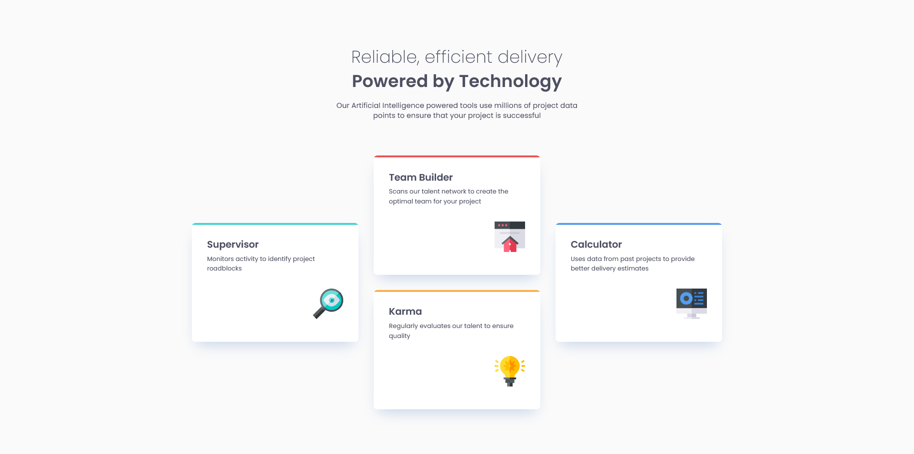
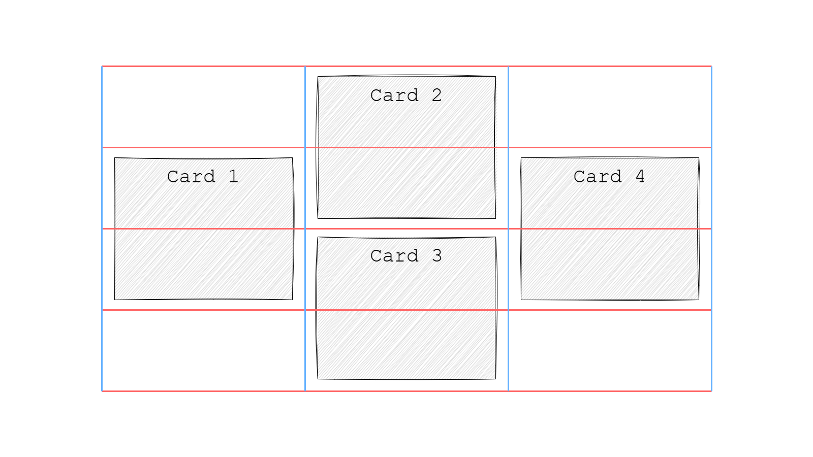
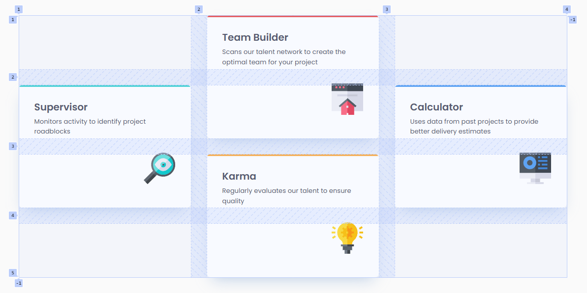

# Frontend Mentor - Four card feature section solution

This is a solution to the [Four card feature section challenge on Frontend Mentor](https://www.frontendmentor.io/challenges/four-card-feature-section-weK1eFYK). Frontend Mentor challenges help you improve your coding skills by building realistic projects. 

## Table of contents

- [Overview](#overview)
  - [The challenge](#the-challenge)
  - [Screenshot](#screenshot)
  - [Links](#links)
- [My process](#my-process)
  - [Built with](#built-with)
  - [What I learned](#what-i-learned)
  - [Useful resources](#useful-resources)
- [Author](#author)

## Overview

### The challenge

Users should be able to:

- View the optimal layout for the site depending on their device's screen size

### Screenshot



### Links

- Solution URL: [View solution on Frontend Mentor](https://www.frontendmentor.io/solutions/four-card-feature-section-made-with-css-grid-zif_jkIJVl)
- Live Site URL: [View live site](https://alexander3717.github.io/FourFeatureCards/)

## My process

### Built with

- Semantic HTML5 markup
- SASS features
- CSS Grid
- Mobile-first workflow

### What I learned

I learned that CSS grid can do a lot of counting for you. At first I thought I'd have to specify a lot of properties to achieve the desired layout but turns out I didn't even need to write the count and size of the grid's rows and columns. It was enough to just give `main` `display: grid` + `gap` and then tell CSS how the cards should be placed on an imaginary grid that I thought would work well for this design (a grid with 4 rows and 3 columns, see the sketch below)

<br>

This is all the code you need to place the cards according to such grid:

```scss
main {
    display: grid;
    gap: $spacing-400;
    // not specifying rows, nor columns
}

.featurecard {
    // just saying which rows and columns each card should span
    // even though we didn't make any rows nor columns, which is kind of cool
    &:nth-child(1) {
        grid-column: 1;
        grid-row: 2 / 4;
    }
    &:nth-child(2) {
        grid-column: 2;
        grid-row: 1 / 3;
    }
    &:nth-child(3) {
        grid-column: 2;
        grid-row: 3 / 5;
    }
    &:nth-child(4) {
        grid-column: 3;
        grid-row: 2 / 4;
    }
    // that's enough for the browser to figure out the grid!
}
```

And here's how that looks in the browser - just like in the design. (The shaded parts are the gaps, you can basically view them as the grid lines)



### Useful resources

- [CSS Grid Garden](https://cssgridgarden.com/) - This game was my first contact with CSS grid. It quickly teaches you the very basics of it
- [Basic concepts of grid layout](https://developer.mozilla.org/en-US/docs/Web/CSS/CSS_grid_layout/Basic_concepts_of_grid_layout) - If you want to better understand how grid works. Less fun than the game though haha

These resources are also recommended in the Frontend Mentor "Building responsive layouts" learning path.

## Author

Frontend Mentor - [@Alexander3717](https://www.frontendmentor.io/profile/Alexander3717)
